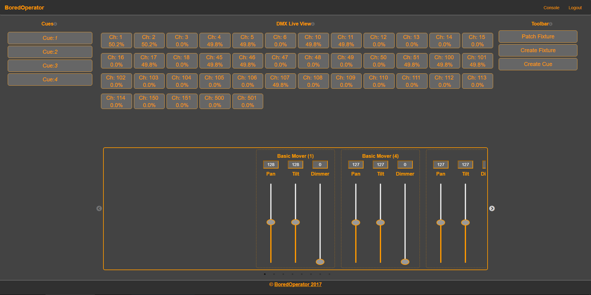
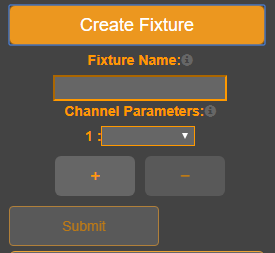
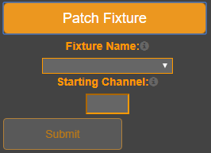
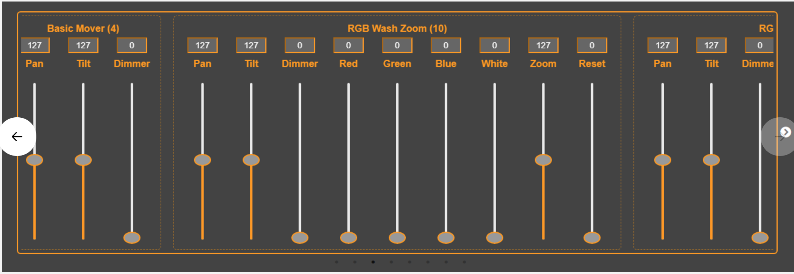
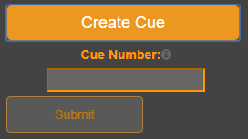

# BoredOperator
An Art-net Lighting Controller run on a Node Express Server



For many small coffeshops and theaters, a lighting board is a considerable investment given that a high quality console can go for several thousands of dollars. The goal of BoredOperator is to provide the functionality of a professional lighting console at a reduced cost and a lower form factor. (A laptop comptuer vs a full sized lighting board). All console data is persisted on a Mongo database.

## How to use

Our code is designed to utlilize a Raspberry Pi as the server which connects to any Art-net node. All users must create a login. Once a user logs in, they are taken to the console page, which is rather blank until we add some fixtures and patch them. Before we can tackle that though, we need to seed our Channel Parameters so you can start creating fixtures.

run:
```
mongoimport --db BoredOperator --collection channelparameters --file channelparameters.json 
```
in the root directory after cloning the repo to your local machine. Be sure to have Mongo installed or your terminal will error out. 
Once you have successfully added the channel seeds, run 
```
npm install
```
to get all of the project dependencies. The post install script will run after which will set up your bundle.js. Then it's time to:
```
npm start
```
to get the server up and running. Head over to localhost:3000 and start playing around!

### 1. Create fixture

 
Click the *Create Fixture* button on the right hand side. Type the name of the fixture into the input field and add the necessary channel parameters from the select boxes. (You must have a name and at least one channel parameter in order to create a fixture)

### 2. Patch a fixture


Once you create a fixture, you can patch it to the DMX universe. Click the *Patch Fixture* button and select a fixture from the dropdown menu. Select a channel number you wish to start the patch at. NOTE: You cannot patch two fixtures to the same channel. i.e. If you fixture has *x* channels and you start the patch from channel *y*, the DMX channels *y* through *y + x* cannot be assigned already. 

Once patched, the channels the fixture has been patch to will display in the console along with their percent values. At the bottom, each patch is displayed in a carousel. Each patch channel will have a slider which can controll the live value of that channel. 




### Playtime!

Once you have created and patched fixtures, it's time to let your creativity flow and make some pretty looks! Any DMX parameter can be adjusted through this console. Feel free to let your imagination flow! When you make something you like, save a cue!


### 3. Create a cue



Create a cue when you want to take a snapshot of all the DMX values in the console. Simply assign the values a cue number-which must be unique-and the cue will appear on the *Cue List* on the left hand side. 

### Live Demo

There is a working demo of the application at: 
[HerokuAPP](https://boredoperator.herokuapp.com)

## Future Development 

Oh Boy... Lots of ideas are going to be tossed into this project. Maybe something will stick. Here's a running list:

Administrator Users/Console

Animation Curves/Fade-Times/Effects engine

Midi Controllers

16bit control channels, (Course and fine Controll)

Custom User Layouts

Fixture Grouping

Presets

Electron Application


